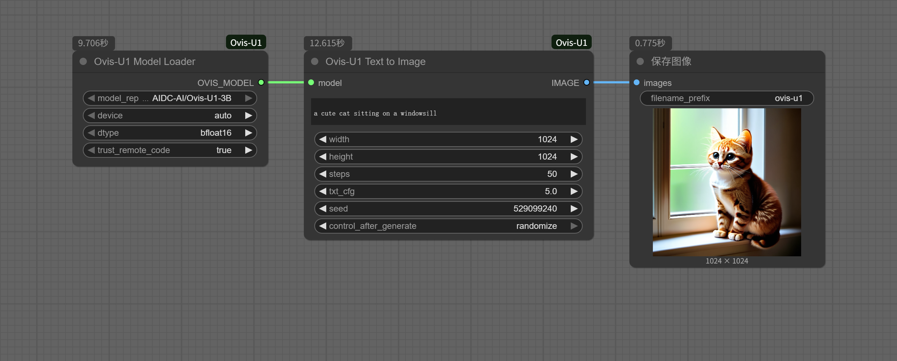
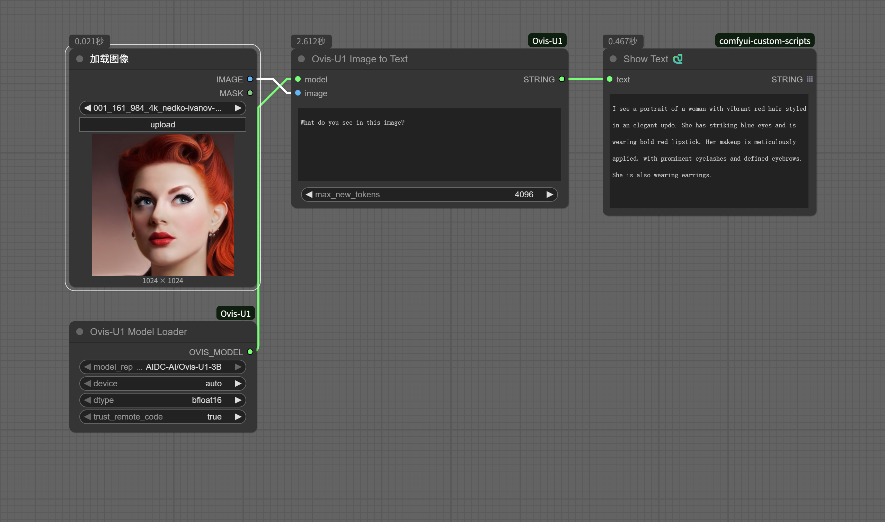

# ComfyUI-Ovis-U1

This repository adds ComfyUI custom nodes that wrap the Ovis-U1 multimodal model, exposing three primary workflows inside the ComfyUI editor.

## Features

- Unified model support (understanding, generation, editing) through simple ComfyUI nodes
- Options for device and dtype selection when loading the model (BF16 / FP16 / FP32)

## Model download

Using the model: `AIDC-AI/Ovis-U1-3B` (Hugging Face). You can either:

1. Place the model under `models/ovis/AIDC-AI/Ovis-U1-3B` manually (preferred for offline use), or
2. Use the `Ovis-U1 Model Loader` node with automatic download enabled.

Sharded weights and safetensors index files are supported. For large models ensure sufficient disk and GPU memory.

## Installation

Clone this repository into your ComfyUI `custom_nodes` directory and install dependencies:

```bash
cd ComfyUI/custom_nodes

git clone https://github.com/neverbiasu/ComfyUI-Ovis-U1.git
```

```bash
cd ComfyUI-Ovis-U1

pip install -r requirements.txt
```

## Workflows

### Text-to-Image Generation

Generate high-quality images from natural language prompts. This workflow shows the minimal node chain to go from prompt to final image.

### Image Understanding (Image → Text)

Perform captioning, visual question answering, and scene understanding. Suitable for extracting structured descriptions from images.

### Image Editing Workflow

Instruction-guided image editing. The node implements the official three-step conditional flow (unconditional, image-only, final conditioned) to produce high-quality edits.

## License

This project is licensed under the Apache 2.0 License. Please refer to the official license terms for the use of the Ovis-U1 model.
